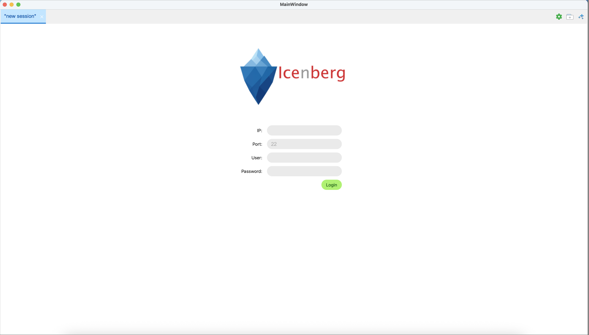

# Icenberg

Icenberg is an open-source shell tool with real-time, context-aware LLM assistance. It understands your terminal output,
helps troubleshoot issues, and lets you ask questions directly from shell sessions.

---

### Screenshot \| 界面预览


---
[English](#english) \| [中文说明](#中文说明)

---
## English

### Overview

Icenberg is a Python-based interactive SSH shell assistant. It provides a terminal-like experience with optional LLM (
Large Language Model) support to help you understand logs, commands, and errors while working on remote servers.

### Features

- **Interactive SSH login**: Start from `main.py`, then log in to any SSH server by entering IP, port, username, and
  password.
- **Shell interaction**: After a successful login, you can run shell commands on the remote server just like in a normal
  terminal.
- **Context-aware assistance**: Understand the current session context to help troubleshoot issues and
  explain commands.

### Quick Start

1. Make sure you have Python 3.12+ installed.
2. Install dependencies:
   ```bash
   pip install PySide6 paramiko requests
   ```
3. Clone this repository:
   ```bash
   git clone https://github.com/EulbThgink/Icenberg.git
   ```
4. Run the application:
   ```bash
   cd Icenberg
   python -m src.main
   ```
5. When prompted, enter:
    - Server IP
    - Port
    - Username
    - Password

   After a successful login, you can start typing shell commands to interact with the remote server.
6. Click the stars button in the upper-right corner to enable the context-aware assistant, which helps you analyze the current session through dialogue and solve problems.
7. Click the gear button in the upper-right corner to configure LLM-related settings (currently supports local LAN models provided by Ollama).
8. Click the add session button in the upper-right corner to add multiple SSH sessions for connecting multiple servers simultaneously.

### Project Structure (simplified)

- `src/main.py`: Program entry point.
- `src/controller/`: Core login/session logic, SSH and LLM interaction.
- `src/view/`: UI-related code.
- `src/model/`: Parsing, SSH client, and remote agent logic.

### Roadmap (optional)

- Session history, bookmarking, and better error display.
- Configurable server profiles and key-based authentication.
- Richer LLM integration for command explanation and debugging.
- Embed an AI agent to automatically run diagnostic commands, aggregate issues, and analyze the root causes.


---

## 中文说明

### 概述

Icenberg 是一个基于 Python 的交互式 SSH Shell 助手工具。你可以像使用普通终端一样远程登录服务器执行命令，并在此基础上接入大语言模型（LLM），帮助你理解终端输出、排查问题、解释命令等。

### 主要功能

- **SSH 登录**：程序启动入口为 `src/main.py`。启动程序后，根据提示依次输入需要登录服务器的 IP、端口、用户名和密码，即可发起 SSH 登录。
- **Shell 命令交互**：登录成功后，就可以像平常使用终端一样输入 Shell 命令，与远程服务器进行交互。
- **上下文感知智能助手**：结合当前会话内容，为排障、日志分析和命令解释提供辅助。

### 快速开始

1. 确认本机已安装 Python 3.12 及以上版本。
2. 安装依赖包：
   ```bash
   pip install PySide6 paramiko requests
   ```
3. 克隆项目代码：
   ```bash
   git clone https://github.com/EulbThgink/Icenberg.git
   ```
4. 启动程序：
   ```bash
   cd Icenberg
   python -m src.main
   ```
5. 按照界面提示依次输入：
    - 服务器 IP
    - 端口
    - 用户名
    - 密码

   登录成功后，即可在界面中输入 Shell 命令，与远程服务器交互。
6. 点击右上角的星星按钮，即可启用上下文感知的智能助手，帮助你通过对话分析当前session内容，解决问题。
7. 点击右上角的齿轮按钮，可以配置 LLM 相关参数（目前支持Ollama提供的本地局域网模型）。
8. 点击右上角添加session按钮，可以添加多个SSH会话，方便同时连接多台服务器。

### 项目结构（简要）

- `src/main.py`：程序入口。
- `src/controller/`：主要控制逻辑，包括登录流程、会话管理、与 SSH/LLM 的交互。
- `src/view/`：界面/UI 相关代码。
- `src/model/`：解析、SSH 客户端及远程代理等逻辑。

### 后续规划

- 支持会话历史记录、标签、多会话管理等功能。
- 支持服务器配置模板、密钥登录等更灵活的认证方式。
- 更完善的 LLM 集成，用于命令解释、错误分析与排障建议。
- 嵌入AI Agent，自动执行诊断命令，并汇总问题并分析原因。


